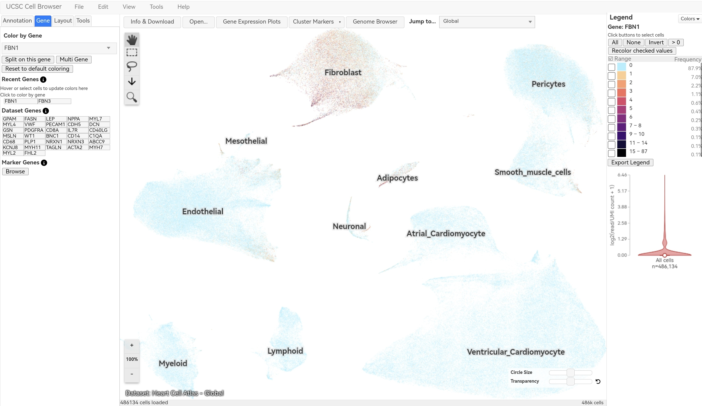
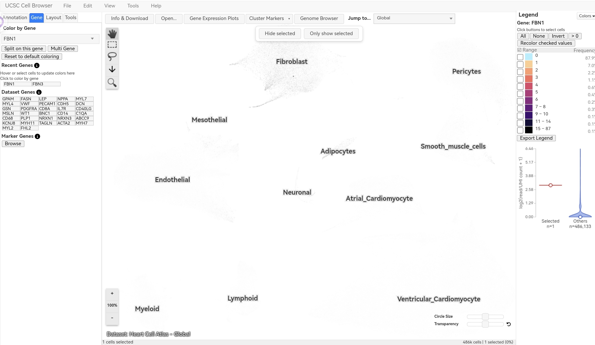
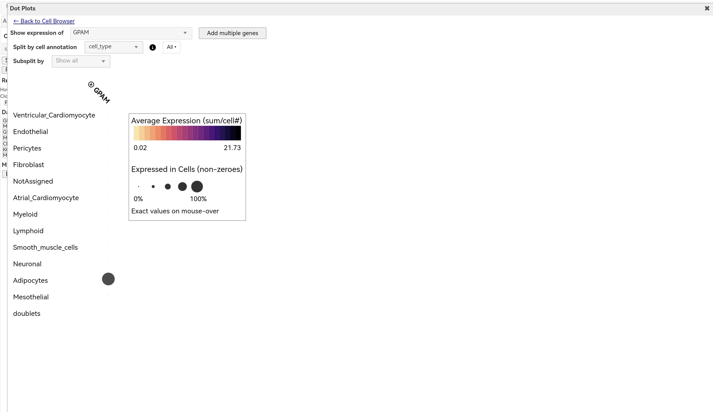
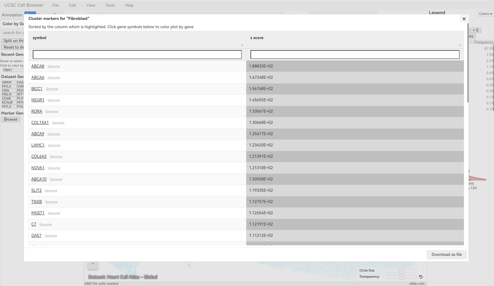

# UCSC Cell Browser — FBN1 / Marfan Syndrome Activity

**Student:** Jade Angela

**Date:** 2026-09-26

**Gene:** FBN1 (Fibrillin 1)

**Disease:** Marfan syndrome

---

## Part A — Introduction
FBN1 encodes fibrillin-1, a major structural component of extracellular microfibrils in connective tissue. Pathogenic variants cause **Marfan syndrome** — a disorder affecting the heart, aorta, eyes, skeleton, and skin. This activity uses single-cell RNA sequencing data from the UCSC Cell Browser to identify which cell types in the human heart express FBN1.

---

## Part B — Dataset Selection
| Item | Information |
|---|---|
| Dataset Name | Heart Cell Atlas — Overview |
| Tissue/Organ | Adult human heart |
| Relevance | Marfan syndrome weakens connective tissue in heart valves, aorta, and vessel walls. FBN1 produces fibrillin-1 to strengthen these structures — this dataset includes fibroblasts, vascular cells, and cardiomyocytes where FBN1 functions. |
| Species | Human (Homo sapiens) |
| Reference | Litviňuková et al. (2020) *Nature* |
| Dataset URL | https://cells.ucsc.edu/?ds=heart-cell-atlas |

**Screenshot 1 — Dataset Selected:**

---
## Part C — Understand the Cell Map

| Question | Answer |
|---|---|
| a. Visualization type | UMAP (Uniform Manifold Approximation and Projection) |
| b. One dot represents | A single individual cell from the adult human heart |
| c. Clusters represent | Groups of cells with similar gene-expression profiles — corresponding to specific cell types or functional states |
| d. Three visible cell-type labels | Fibroblast, Endothelial, Smooth muscle cells |

---
 ## Part D — FBN1 Gene Expression
 | Question | Answer |
 |---|---|
 | a. Assigned gene symbol | FBN1 |
 | b. Dataset used | Heart Cell Atlas — Global (486k cells) |
 | c. Expression pattern | Restricted — not uniformly expressed across all cells; concentrated in specific clusters |
 | d. Strongest expression clusters | Fibroblast cluster (highest levels — orange/brown coloring) |
 | e. Low/no expression clusters | Endothelial cells, Atrial/Ventricular Cardiomyocytes, Myeloid, Lymphoid — mostly light blue, near-zero detection |
 **Screenshot 2 — FBN1 Expression Map:**
 

 ---
## Part E — Cell Types Expressing FBN1

| Question | Answer |
|---|---|
| a. Strongest expression cluster | Fibroblasts — selected and clearly the most prominent cluster with FBN1 activity |
| b. Second detectable cluster | Smooth_muscle_cells / Pericytes — visible but lower signal |
| c. Low/undetected clusters | Endothelial, Atrial/Ventricular Cardiomyocytes, Myeloid, Lymphoid — faint/near baseline |
| d. Expression pattern | Highly cell-type restricted — concentrated in fibroblasts that build connective tissue |
| e. Biological explanation | FBN1 produces fibrillin-1, the main structural protein in connective tissue. Fibroblasts are the primary cells that synthesize and secrete this extracellular matrix — so they show the highest expression. Smooth muscle cells also support vessel walls but at lower levels. Cardiomyocytes and endothelial cells have different specialized functions and do not produce significant fibrillin-1. |

**Screenshot 3 — Selected Fibroblast Cluster & FBN1 Expression:**

---
## Part F — Expression Plot (Dot Plot)

| Question | Answer |
|---|---|
| a. Selected cells / cluster examined | Fibroblast cluster |
| b. Expression compared to other clusters | FBN1 shows the highest expression in fibroblasts — both average level (color intensity) and percentage of cells expressing it (dot size) are far greater than in any other cell type. Smooth muscle cells and pericytes show faint signal; all other clusters are near baseline. |
| c. Additional insight from the plot | The UMAP map shows spatial distribution; the dot plot quantifies **both expression magnitude and prevalence**. It reveals that FBN1 is not just high in a few cells — it is a consistent feature of fibroblasts. This supports its biological role: fibrillin-1 is a core extracellular matrix protein produced broadly by connective tissue–making cells, not by other heart cell types. |

**Screenshot 4 — FBN1 Dot Plot by Cell Type:**

---
## Part G — Cluster Marker Genes

| Question | Answer |
|---|---|
| a. Cluster examined | Fibroblast |
| b. Top 3 marker genes | ABCA8, ABCA6, BICC1 |
| c. Definition of marker genes | Genes that are significantly more highly expressed in one cell type compared to all others — they serve as molecular identifiers for that cell population |
| d. Biological interpretation | The top markers confirm the fibroblast identity of this cluster. Fibroblasts are the primary cells responsible for producing and maintaining the extracellular connective tissue matrix — the same biological process where FBN1 (fibrillin-1) functions. This independently verifies that FBN1 is expressed in the correct cell type for its structural role. |

**Screenshot 5 — Fibroblast Marker Genes:**

---
## Part H — Compare Assigned Gene with Marker Gene

| Item | Answer |
|---|---|
| a. Assigned disease gene | FBN1 |
| b. Marker gene selected | ABCA8 (top fibroblast marker) |
| c. Which shows more restricted pattern | ABCA8 — expression is nearly exclusive to fibroblasts; no meaningful signal detected in any other cell cluster |
| d. Which appears more broadly expressed | FBN1 — highest in fibroblasts but also shows faint, above-baseline expression in Smooth_muscle_cells and Pericytes |
| e. Biological meaning of the difference | Marker genes such as ABCA8 act as highly specific molecular signatures — their expression is confined almost entirely to one cell type, making them reliable identifiers. Disease-associated genes like FBN1 encode functional proteins that can operate across related cell populations. FBN1 produces fibrillin-1 for connective tissue matrix — fibroblasts are the main producers, but smooth muscle cells and pericytes also contribute to vessel wall structure, hence the broader signal. This reveals: marker genes reflect *cell identity*, while disease genes reflect *biological function*, which may span cooperating cell types. |

---
## Part I — Connect Cell Browser with Genome Browser

| # | Question | Answer |
|---|---|---|
| 1 | Chromosome location of FBN1 | Chromosome 15, long arm — band 15q21.1 |
| 2 | Disease-associated variant examined | FBN1 pathogenic variants (missense, frameshift, splice-site, or premature stop codons) leading to abnormal or reduced fibrillin-1 → Marfan syndrome |
| 3 | Cell types with FBN1 expression | Highest in fibroblasts; lower but detectable in smooth muscle cells and pericytes; near absent in cardiomyocytes, endothelial cells, and immune cells |
| 4 | Does expression make biological sense? | Yes. FBN1 encodes fibrillin-1, the core structural protein of connective tissue microfibrils. Fibroblasts are the main cells that synthesize and secrete this extracellular matrix — hence their highest expression. Smooth muscle cells also reinforce vessel walls but produce less fibrillin-1, explaining their lower signal. Cardiomyocytes and endothelial cells perform specialized contractile or barrier functions and do not serve as primary matrix producers, so their naturally low levels are expected. This pattern directly aligns with Marfan’s clinical features — tissues rich in fibroblast-produced matrix (aorta, heart valves, ligaments) are most vulnerable. |
| 5 | Can this dataset prove FBN1 causes disease? | No. Expression data show *where* a gene is active but not *that* changes in it cause illness. Causation requires genetic evidence: variants present in affected individuals, absent in healthy controls, demonstrated to alter protein function, and consistent inheritance patterns. This dataset strengthens biological plausibility by confirming FBN1 acts in the right cell types — but plausibility ≠ proof. |

## Part J — Short Reflection
 **1. What did the UCSC Cell Browser show you that the UCSC Genome Browser could not?**
 The Cell Browser showed FBN1 expression across distinct cell types — clearly highlighting fibroblasts as the main source while revealing low levels in smooth muscle cells and pericytes. The Genome Browser displays DNA sequence, gene structure, and variant data but cannot distinguish which cells actually express the gene or at what magnitude.
 
 **2. Why can the same gene have different expression levels among different cell types?**
 All cells share identical DNA, but each cell type expresses only the genes required for its specialized function. Fibroblasts highly express FBN1 because their role is producing connective tissue matrix; cardiomyocytes and endothelial cells have different primary duties and do not need large amounts of fibrillin-1, so expression remains low.

 **3. Why should you be careful when interpreting zero or very low expression?**
 Low or absent detection does not always mean the gene is non-functional — it may be expressed only in rare cell subtypes, at specific developmental stages, or under physiological conditions not captured in this dataset. Technical limitations in detection sensitivity can also create false negatives.
 
 **4. Why combine genomic location, variants, and cell-specific expression?**
 Genomic location identifies the gene and its regulatory regions; variants reveal how changes disrupt protein function; expression data pinpoints exactly which cell types rely on that gene. Together they link cause (DNA change) through mechanism (altered protein) to effect (disease in vulnerable tissues), building a complete biological story.

 **5. Most interesting observation about your assigned gene?**
 FBN1 was not restricted to fibroblasts — it also appeared at lower levels in smooth muscle cells and pericytes, showing that related cell types cooperate to maintain vessel wall integrity. This broader expression pattern makes biological sense and helps explain why Marfan syndrome affects multiple tissues, not just one cell type.

