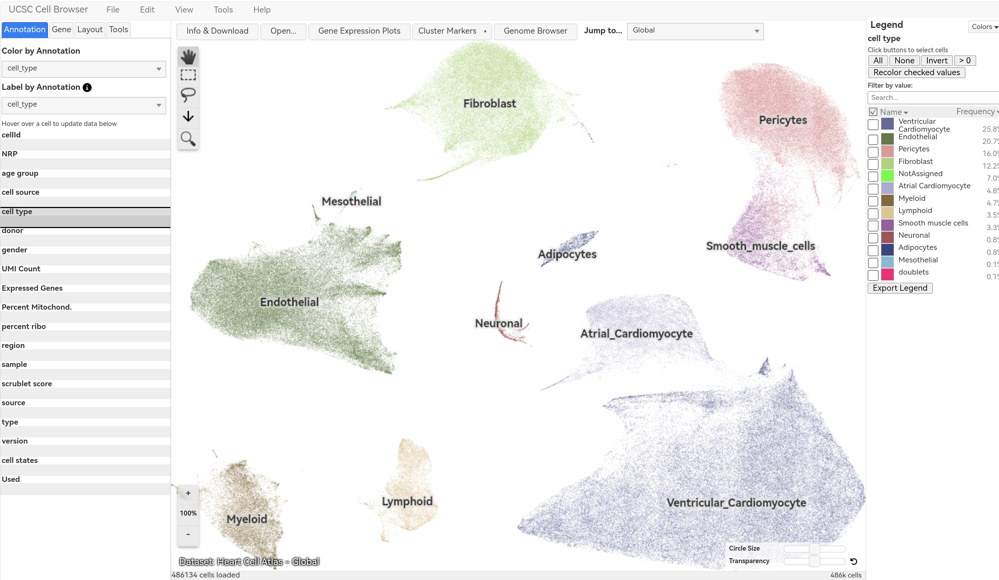

# UCSC Cell Browser — FBN1 / Marfan Syndrome Activity

**Student:** Jade Angela

**Date:** 2026-09-26

**Gene:** FBN1 (Fibrillin 1)

**Disease:** Marfan syndrome

---

## Part A — Introduction
FBN1 encodes fibrillin-1, a major structural component of extracellular microfibrils in connective tissue. Pathogenic variants cause **Marfan syndrome** — a disorder affecting the heart, aorta, eyes, skeleton, and skin. This activity uses single-cell RNA sequencing data from the UCSC Cell Browser to identify which cell types in the human heart express FBN1.

---

## Part B — Dataset Selection
| Item | Information |
|---|---|
| Dataset Name | Heart Cell Atlas — Overview |
| Tissue/Organ | Adult human heart |
| Relevance | Marfan syndrome weakens connective tissue in heart valves, aorta, and vessel walls. FBN1 produces fibrillin-1 to strengthen these structures — this dataset includes fibroblasts, vascular cells, and cardiomyocytes where FBN1 functions. |
| Species | Human (Homo sapiens) |
| Reference | Litviňuková et al. (2020) *Nature* |
| Dataset URL | https://cells.ucsc.edu/?ds=heart-cell-atlas |

**Screenshot 1 — Dataset Selected:**

---
## Part C — Understand the Cell Map

| Question | Answer |
|---|---|
| a. Visualization type | UMAP (Uniform Manifold Approximation and Projection) |
| b. One dot represents | A single individual cell from the adult human heart |
| c. Clusters represent | Groups of cells with similar gene-expression profiles — corresponding to specific cell types or functional states |
| d. Three visible cell-type labels | Fibroblast, Endothelial, Smooth muscle cells |

**Screenshot 2 — UMAP Cell Map:**

